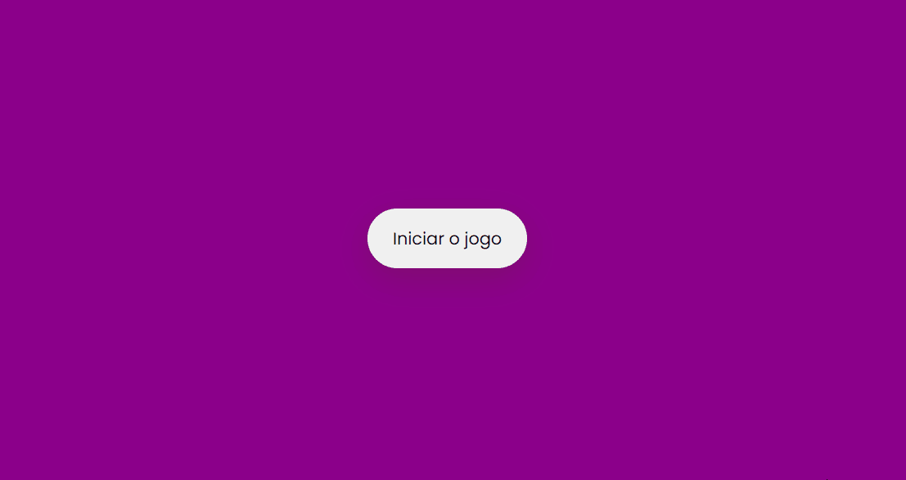

## 🧾 Descrição

O código é um jogo de memória que gera uma matriz de cartas aleatórias com imagens de bandeiras. O jogador deve clicar em duas cartas para ver se elas correspondem. Se as cartas coincidirem, elas permanecerão viradas para cima e serão marcadas como correspondentes. Se as cartas não coincidirem, elas serão viradas para baixo novamente. O jogo inclui um contador de tempo, um contador de movimentos e um botão para reiniciar o jogo. 

<h1>

## 🔌 Tecnologias utilizadas

- **HTML:** linguagem de marcação usada para estruturar e apresentar o conteúdo da página;
- **CSS:** linguagem de estilo usada para estilizar a página, incluindo layout, fontes, cores, etc;
- **JavaScript:** Linguagem de programação que permite criar interações dinâmicas na web. Com ela é possível manipular o conteúdo HTML e CSS em tempo real, validar formulários, criar animações, entre outras possibilidades

## ⚙️ Estrutura

- **img:** Contém imagens utilizadas no projeto e para apresentação no Readme.md;
- **index.html:** Contém a linguagem de marcação usada para estruturar e apresentar o conteúdo da página;
- **style.css:** Contém regras de estilo que são usadas para personalizar a aparência da página HTML. Ele inclui configurações de fonte, cor de fundo, posicionamento e tamanho de elementos, e outras propriedades de estilo para tornar a página mais atraente e fácil de usar.
- **script.js:** Inclui funções para gerar o tabuleiro do jogo com cartas de bandeira aleatória, para iniciar um cronômetro e contar os movimentos do jogador e para lidar com a lógica do jogo quando o jogador clica em uma carta.

## 🏳️ Como executar?

### **Passo 1**
Faça download do repositório

### **Passo 2**
Abra o arquivo "Index.html" em um navegador e teste as funções.

 

## ✅ Resultado (Preview)

### **Game**

 

## 💻 Autor: Luan Ferreira

Portfólio:
- [Github](https://github.com/fluanbrito)

Contato:
- [Linkedin](https://www.linkedin.com/in/luanferreirab/)

<h1>

## 🚀 Sobre mim
Sou um grande entusiasta e apaixonado por tecnologia, empreendedorismo e inovação. Hoje, estou a cursar o curso de Sistema de Informação pelo Instituto Federal, faço uso profissionalmente de ferramentas e me aprofundo em temas como Marketing, Machine Learning AWS, Metodologias ágeis, Gestão de Projetos, Programação Web, Administração de Sistemas, Redes de computadores, entre outros.